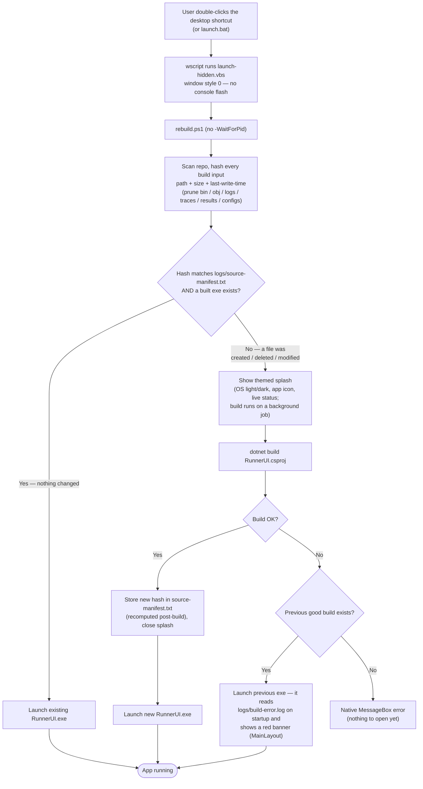

# Launch — Opening the App

What happens when the user opens the app via the **desktop shortcut** or `launch.bat`.
The everyday open path is *silent* (no console) and only rebuilds when source actually
changed — a fast source-manifest check, not an unconditional build. See CLAUDE.md
("Setup, launch, and the build/watch lifecycle") for the mechanism, and `scripts/rebuild.ps1`.

Key rule: **the app never rebuilds itself** — it holds the test assembly loaded (locked),
so building is always an external script (`rebuild.ps1`) that runs *before* the app opens.

## The other entry point: in-app "Restart & rebuild"

The same `rebuild.ps1` also drives the author loop. When `TestsWatcher` sees `src/tests/*.cs`
change, `MainLayout.razor` shows a banner whose **Restart & rebuild** button hands off to
`rebuild.ps1 -WaitForPid <own pid>` in a **visible** console, then exits. That path is a
deliberate rebuild click, so it **skips the staleness check and always builds** (and shows
the console instead of the splash) — it first waits for the app to close so the test DLL
unlocks, then builds and relaunches.
