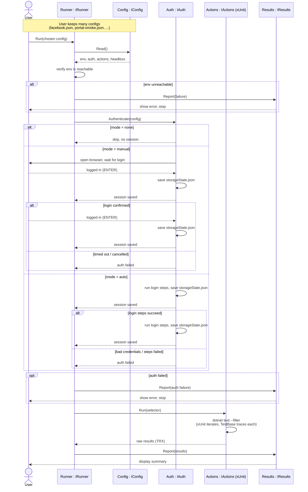

# Sequence — Program Flow

The user keeps a collection of configs and hands **one** to the runner per run.
The runner then orchestrates Config, Auth, Actions, and Results through their interfaces.

