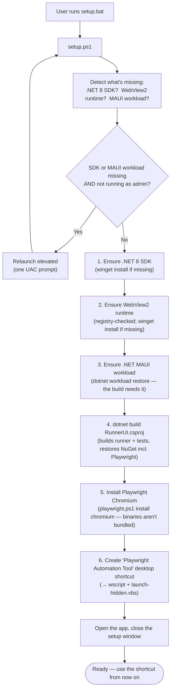

# Setup — First-Run on a Fresh Machine

What happens the first time the user runs `setup.bat` (→ `scripts/setup.ps1`). It's
**one-time and idempotent** — safe to re-run; each step is skipped if already satisfied.
It ends by opening the app; every launch after that uses the shortcut (see `launch.md`).

Only two steps need admin — installing the **SDK** and the **MAUI workload** — so setup
checks what's missing *first* and self-elevates (one UAC prompt) only if one of those is
absent. If everything's present, it runs without elevation.

> **Long-path caveat:** MAUI build artifacts nest deeply (`obj\Debug\net8.0-windows…\win10-x64\…`),
> so a long starting folder can exceed Windows' 260-char limit and fail the build. Setup
> *warns* (doesn't block) when the repo path is long; if the build fails with "path too
> long", move the folder somewhere short (e.g. `C:\PAT`) and re-run.
