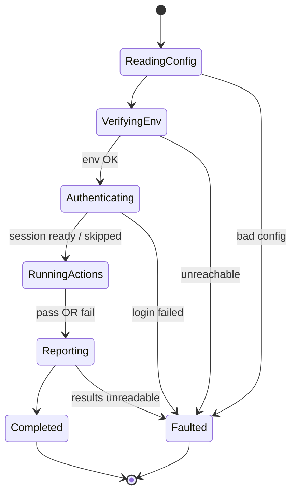

# State Chart — Runner Lifecycle

`RunContext.Current` always holds the state below, so at any instant — including a
crash or hang — we know exactly where we are.

Key rule: **`RunningActions → Reporting` fires on pass _or_ fail.** A run where tests
fail is still a *successful runner*; it reports normally. `Faulted` is reserved for the
runner itself breaking (bad config, dead env, failed login, unreadable results) — test
failures never land there.

